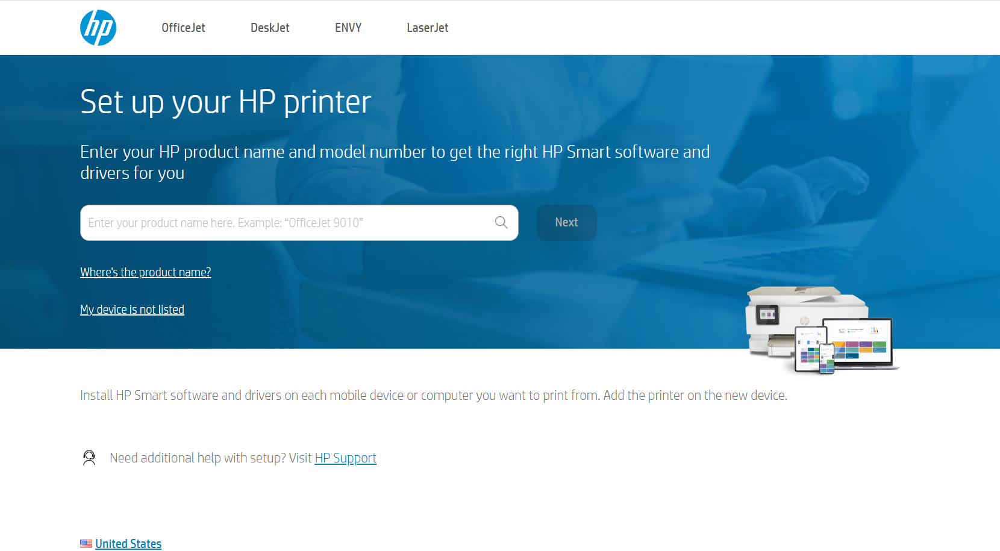

# Set Up Your HP Printer: 123.hp.com
  
---

  

# How to Set Up Your HP Printer

**Follow these steps to easily set up your HP printer and get started printing.**

1. Carefully remove your HP printer from the box and remove all protective packaging materials.
2. Connect the power cord to the printer and plug it into an electrical outlet. Press the power button to turn on the printer.
3. Open the printer's ink cartridge door and install the ink cartridges by following the color-coded guides. Ensure the cartridges are securely in place.
4. Open the paper tray and load it with the appropriate paper size. Adjust the paper guides to ensure the paper is properly aligned.
5. Connect to Your Network (Wi-Fi or USB)
- **Wi-Fi Setup**: On the printer's control panel, navigate to the Wi-Fi settings and select your network. Enter your Wi-Fi password to connect.
- **USB Setup**: If you're connecting via USB, plug the USB cable into the printer and your computer.
6. Download and install the HP printer software from the [123.hp.com/setup](https://support.hp.com) or use the included installation CD. Follow the on-screen instructions to complete the installation.
7. Once the software is installed, go to your computer’s printer settings and select your HP printer as the default printer.
8. Print a test page to ensure the printer is working correctly and is connected properly to your computer or network.

Now your HP printer is all set up and ready to use!
